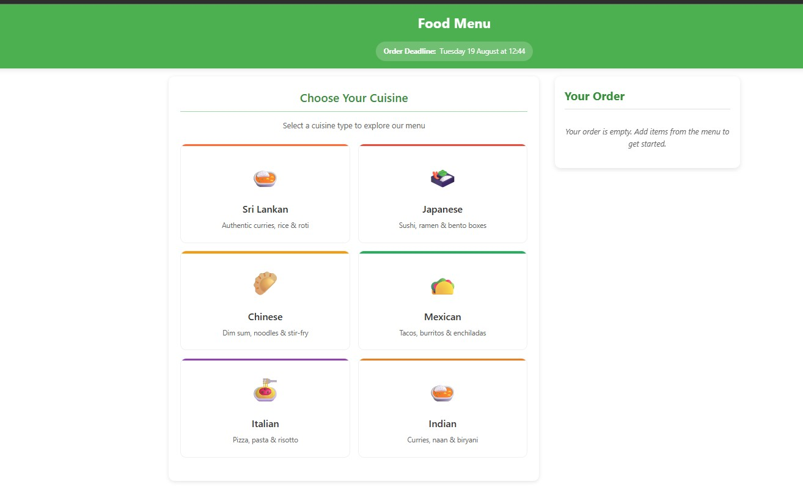
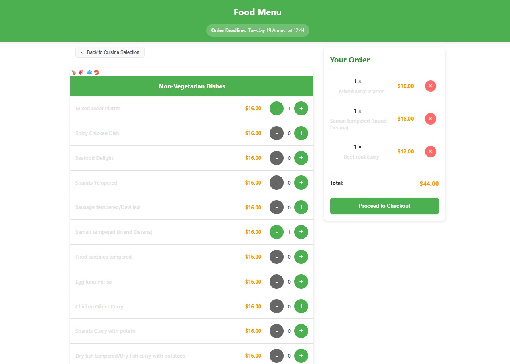
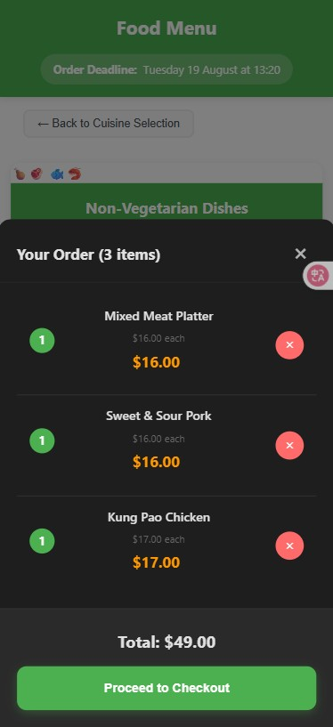
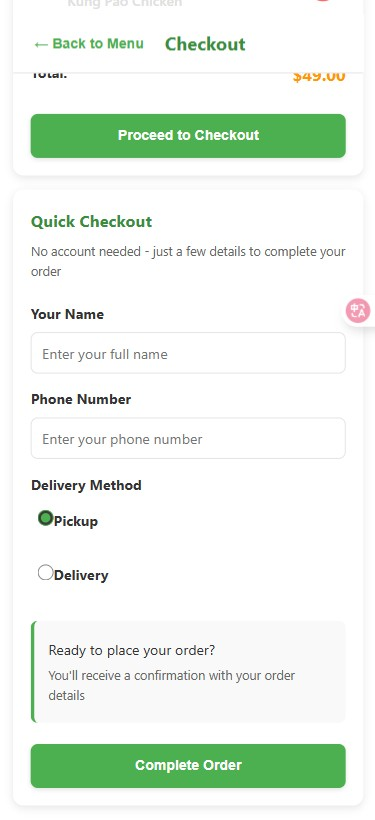

Food Ordering App 🍛

A comprehensive, mobile-first React application for weekly food ordering with a modern cuisine-based menu system and admin management features.

## 🌟 Key Features

### 📱 Mobile-First Design

- **Responsive Layout**: Optimized for mobile devices with touch-friendly interfaces
- **Bottom Navigation**: Mobile navigation bar with Menu and Cart buttons
- **Floating Cart Modal**: Bottom sheet-style cart with smooth animations
- **Auto-Navigation**: Automatic scroll to checkout when proceeding from cart
- **Safe Area Support**: Proper handling of notched phones and screen insets
- **Clean White Theme**: Pure white background throughout for modern aesthetics

### 🍽️ Cuisine-Based Menu System

- **Multiple Cuisines**: Sri Lankan, Japanese, Chinese, Mexican, Italian, Indian
- **Interactive Selection**: Choose cuisine first, then browse relevant dishes
- **Easy Navigation**: Back buttons to switch between cuisines seamlessly
- **Categorized Items**: Non-vegetarian, Vegetarian, and Extras for each cuisine
- **Direct Ordering**: Select individual dishes with quantity controls

### 🛒 Enhanced Cart Experience

- **Mobile Cart Modal**: Full-screen cart with detailed item information
- **Quantity Management**: Easy increment/decrement with visual feedback
- **Cart Badge**: Real-time item count display
- **Remove Items**: Touch-friendly remove buttons
- **Order Summary**: Clear breakdown of selected items and total

### 👨‍💼 Admin Dashboard

- **Order Management**: View, sort, and filter all customer orders
- **Menu Management**: Add, edit, delete menu items with image uploads
- **WhatsApp Integration**: Send order confirmations and updates
- **Dummy Data System**: Built-in test data for development
- **Order Statistics**: Real-time order counts and revenue tracking

### 📱 WhatsApp Integration

- **Admin Messaging**: Pre-made message templates for order updates
- **Order Confirmation**: "Your order has been confirmed"
- **Ready for Pickup**: "Your order is ready for pickup"
- **Delivery Updates**: "Your order is on the way"
- **Custom Messages**: Flexible messaging system
- **Free Integration**: Uses wa.me URLs (no API costs)

## 🛠️ Technology Stack

- **Frontend**: React 19 + TypeScript + Vite
- **Styling**: CSS3 with CSS Custom Properties
- **Routing**: React Router v7
- **Backend**: Firebase Firestore (optional)
- **State Management**: React Hooks (useState, useEffect, useRef)
- **Build Tool**: Vite with HMR
- **Type Safety**: Full TypeScript implementation

## 🚀 Quick Start

### Prerequisites

- Node.js 16+ and npm
- Firebase project with Firestore enabled (optional)

### Installation

1. **Clone the repository**:

```bash
git clone <repository-url>
cd Food_Order
```

2. **Install dependencies**:

```bash
npm install
```

3. **Environment Setup** (Optional - for Firebase integration):
   Create a `.env` file in the root directory:

```env
VITE_FIREBASE_API_KEY=your_api_key
VITE_FIREBASE_AUTH_DOMAIN=your_auth_domain
VITE_FIREBASE_PROJECT_ID=your_project_id
VITE_FIREBASE_STORAGE_BUCKET=your_storage_bucket
VITE_FIREBASE_MESSAGING_SENDER_ID=your_messaging_sender_id
VITE_FIREBASE_APP_ID=your_app_id
```

4. **Start development server**:

```bash
npm run dev
```

5. **Access the application**:

- Customer Menu: `http://localhost:5174/`
- Admin Dashboard: `http://localhost:5174/admin`

## 📁 Project Structure

```
src/
├── components/           # Reusable UI components
│   ├── CuisineSelector.tsx    # Cuisine selection interface
│   ├── MenuListView.tsx       # Menu items display
│   ├── OrderSummary.tsx       # Cart and order summary
│   ├── CustomerForm.tsx       # Checkout form
│   ├── MobileCartModal.tsx    # Mobile cart overlay
│   ├── MobileNavigation.tsx   # Bottom navigation
│   └── AdminWhatsAppMessages.tsx # Admin messaging
├── pages/               # Main application pages
│   ├── MenuPage.tsx    # Customer-facing menu
│   ├── AdminPage.tsx   # Admin dashboard
│   └── SuccessPage.tsx # Order confirmation
├── services/           # External service integrations
│   └── firebase.ts    # Firebase Firestore operations
├── types/              # TypeScript type definitions
├── utils/              # Utility functions and data
│   ├── dummy-data.ts  # Sample data for testing
│   └── whatsapp.ts    # WhatsApp integration utilities
└── styles/             # CSS stylesheets
```

## 🎯 Core Functionality

### Customer Experience

1. **Cuisine Selection**: Choose from available cuisines
2. **Menu Browsing**: View dishes categorized by type
3. **Cart Management**: Add/remove items with quantity controls
4. **Checkout Process**: Simple form for delivery/pickup details
5. **Order Confirmation**: Success page with order details

## 📱 Screenshots

### Customer Interface


_Interactive cuisine selection grid with multiple cuisine options_

_Clean menu with quantity controls and categorized dishes_

_Bottom sheet cart modal for order management_


_Simple delivery/pickup form for completing orders_

### Admin Dashboard


_Admin dashboard with order management and sample data_

### Admin Features

1. **Order Dashboard**: View and manage all customer orders
2. **Menu Management**: Add, edit, and remove menu items
3. **WhatsApp Communication**: Send updates to customers
4. **Data Export**: Export order data for analysis

## 🔧 Development Features

### Built-in Testing

- **Dummy Data**: Generic sample data for development (no real addresses or specific dish names)
- **Fallback Logic**: Automatic fallback when Firebase unavailable
- **Graceful Degradation**: App works without Firebase
- **Error Handling**: Robust error handling throughout

### Code Quality

- **TypeScript**: Full type safety and IntelliSense
- **ESLint**: Code quality and consistency
- **Modern React**: Latest React patterns and hooks
- **Responsive Design**: Mobile-first approach

## 🚀 Deployment

### Build for Production

```bash
npm run build
```

### Preview Production Build

```bash
npm run preview
```

### Environment Variables

Ensure all Firebase configuration variables are set in production environment.

## 🤝 Contributing

1. Fork the repository
2. Create a feature branch
3. Make your changes
4. Test thoroughly
5. Submit a pull request

## 📄 License

This project is open source and available under the [MIT License](LICENSE).

## 🆘 Support

For support or questions, please open an issue in the repository.

---

**Note**: This app is designed to work both with and without Firebase. When Firebase is not configured, it automatically falls back to dummy data, making it perfect for development, testing, and demonstration purposes.
